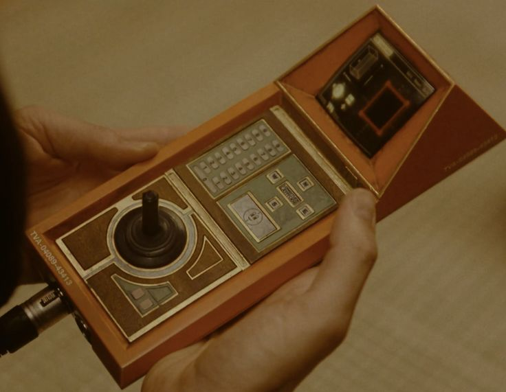
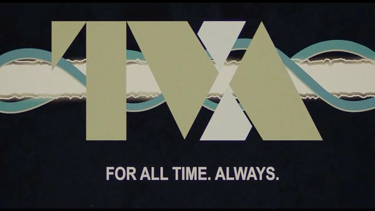
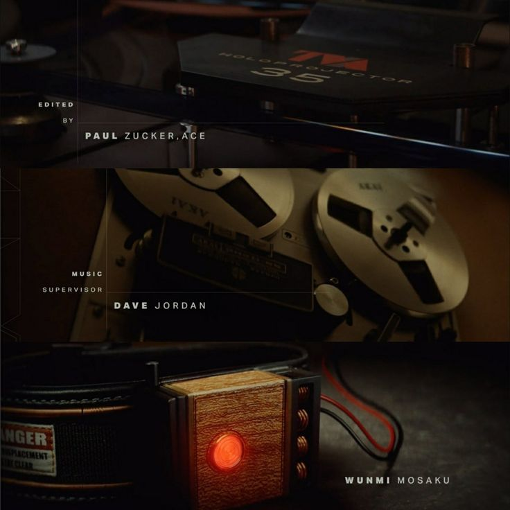
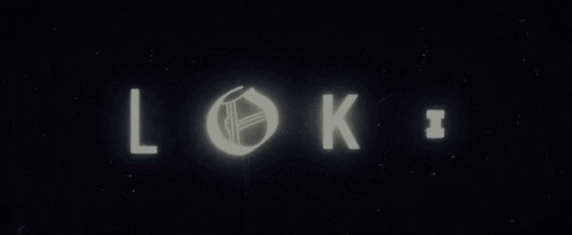

# MischiefOS
A Retro - Futuristic themed OS inspired by MARVEL TV SERIES ___"LOKI"___
---
[CLICK ME](https://mischief-os.vercel.app/)
---
### Here's My MOODBOARD

---
## Everything You'll see on the interface is ideat and coded by myself.
## Used AI just for debugging.
## The mistakes and even wrong logic(which also mine) was resolved by me by apply understanding problem. 
## So consider AI just used for finding what causing errors, not to solve that errors.
--- 
### What my idea is:
- Retro Futurism interface that doesn't feel heavy and bold.
- Just a unique art direction that differentiate ongoing Tech Trend.
- So I started Brainstorming and come to conclusion:
> I can't think to go againts the choice of LOKI

### Features 
---
1. Intro
   - Shows Intro Details about My OS with MOODBOARD
   - Link to my Github Repo
2. Journal
   - A real TVA(A organization in Series) Inspired Journal book
   - every note stored locally.
   - pagination

### What you will experience during review is pure retro futuristc world - an enviroment - a timeline where things gone beyond current technology

### This is very important for me and my projects in Stardance.
Here i came to tell about how i made functionalities and projects.

1. First of all, when i started in stardance i didn't have a laptop, in fact during my diploma study till 3 years - i can't bought one.
2. but at this time when i shipped webos1 project, I bought a second hand laptop(after 2.5 year in diploma).
3. Before that i was coding in my friend's laptop.
4. And during my college hours, when i got some free time i start coding in my Android Device via Acode Editor.
5. So the laptop or windows is maximumly used for entire project creation but i also used android for micro-mini functionalities and adjustments

### So i'm very thankfull and pleasure to have things like:
1. [**!Github**](https://github.com/) - who secure my code and give me acceess on the go.
2. [**!Acode**](https://acode.app/) - which allows me to code in every language i learnt, use terminal and yeah importantly the preview feature.

> ### I litteraly used bluetooth mouse in android and audited all the visual designs and code in Android and acode preview.
## My laptop crashed - devlog with combinig 2 days work

My laptop crashed and i don't know why but it was just heating up without much load. when i start the laptop the gpu fan just abnormally very fast and then it just increaisingly heats. so my whole yesterday was went into this, and now it just at service center and i don't know when i get it to continue on it.

### So it was a situation made by fate but i'm not the guy who just stop at that problem
### So this is devlog for 2 days combined work done

#### what i made: BTW There are some crazzzy interactions i've build, but it is surprise. just test yourself!, go visit project.
> sorry because of sone styling and same icon use, im just making it work now!

1. A fully working terminal app with just couple of personalized commands
2. Currently working on Music Player

- So not whole terminal app but some complex syntax and minimal logic was done by watching youtube tutorials and chatgpt at conclusion and to ensure if i learnt right thing.
- also as i said not whole app just learning logic of how to make my own music player
- btw just learnt how to apply logic and how to serve different solutions to different ideas
### Devlogging after some long days, because i went on college trip

As Readers will know i was working on music player, i just decided what logic & code flow i have to apply.
I watched some tutorials, asked chatgpt for different suggestions and how to execute, but none of them was seems to work for me and my idea.

so i now i'm going to apply the logic what my mind created and let me go for it for a test.

this the song disk i am thinking to place in music player
